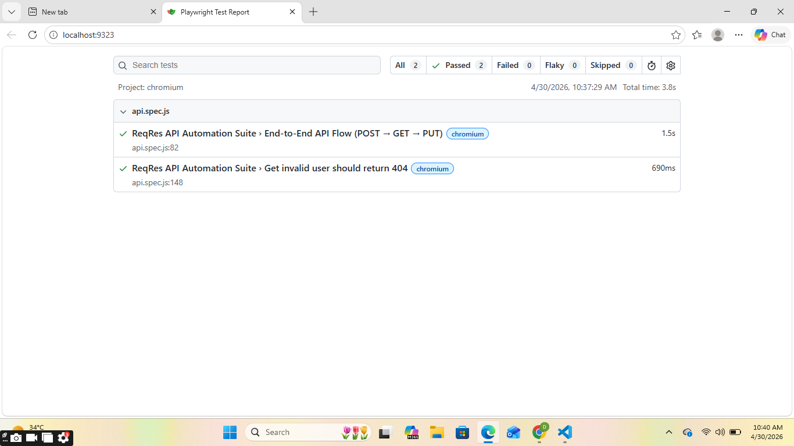

# Playwright API Automation Assignment

##  Tech Stack
- Playwright (JavaScript)
- Node.js

## Test Coverage
- POST /api/users
- GET /api/users/{id}
- PUT /api/users/{id}
- Negative test (404 validation)

##  Note
ReqRes is a mock API and does not persist data.
So static user ID is used for GET and PUT validation.

## ▶ How to Run
npm install
npx playwright test

## Test Report
